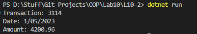

# OOP Lab Tasks (C# .NET 7.0)

## Lab Task 10 - Q2

Create an interface **Itransaction** contain void showTransaction(), double getAmount() ,Create class **Transaction** that inherit **Itransaction** and contains private string tCode; private string date; private double amount; add default constructor and parametric constructor to initialize values and implement void showTransaction(), double getAmount()in class.

### Output

[FurqanHun Github](https://github.com/FurqanHun)