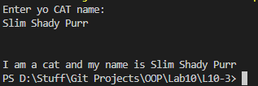

# OOP Lab Tasks (C# .NET 7.0)

## Lab Task 10 - Q3

Write C# code for implementing interface **‘IAnimal’** which declares a method **AName()** in it and then class **InterImp** implements this method being inherited from interface IAnimal. Method AName will simply print the name of the animal like “ I am a cat and my name is:” +name.

### Output

[FurqanHun Github](https://github.com/FurqanHun)