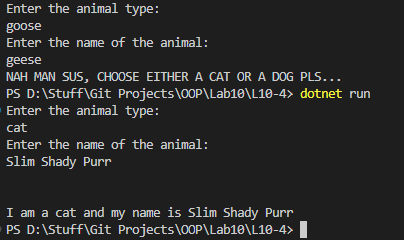

# OOP Lab Tasks (C# .NET 7.0)

## Lab Task 10 - Q4

Update the above program (Lab Task 10 - Q3) by taking user input in method **AName( )**. Input the type of animal whether dog or cat and then the name of the animal. Then this method will be implemented in inherited class.

### Output

[FurqanHun Github](https://github.com/FurqanHun)