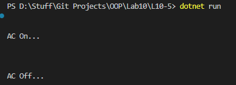

# OOP Lab Tasks (C# .NET 7.0)

## Lab Task 10 - Q5

Write a program that implements an interface for **AC** and declares two methods **ACOn( )** and **ACOff( )**. Both the methods will print apprpiate messages of “AC Off” or “AC On” when implemented and called in inherited class **ACInterImp**.

### Output

[FurqanHun Github](https://github.com/FurqanHun)