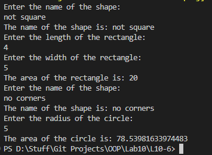

# OOP Lab Tasks (C# .NET 7.0)

## Lab Task 10 - Q6

Write a program that implements interface **IShape** that declares method **SName** that inputs name of shape from user and also method **ShArea** that calculates area of shape.

*Hint: method for area calculation will implement if-then-else and compare the input with shape string to calculate area of a specific shape.*

### Output

[FurqanHun Github](https://github.com/FurqanHun)