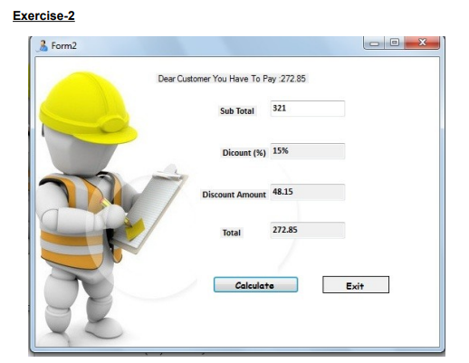
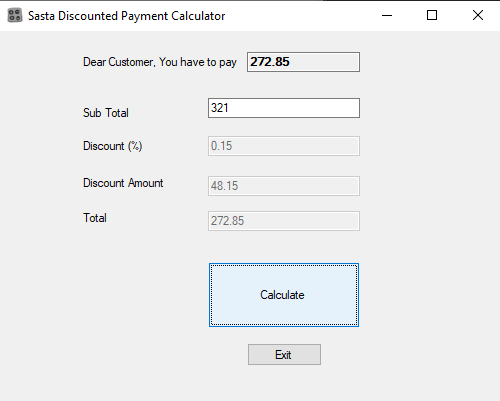

# OOP Lab Tasks (C# .NET Frameqork 4.7.2)

## Lab Task 11 - Q2

**Pressing the Calculate button should give us the following procedure:**

Value entered into Subtotal TextBox is transferred to the variable Subtotal.
double Subtotal=Convert.ToDouble(txtSubtotal.Text);

**Determine DiscountPercent from the following requirements:**
If Subtotal >= 500 then DiscountPercent = 20%.
If Subtotal < 500 and Subtotal >= 250 then DiscountPercent = 15%.
If Subtotal < 250 and Subtotal >= 100 then DiscountPercent = 10%.
Otherwise, DiscountPercent = 0%.

Multiply the Subtotal by the DiscountPercent to get a DiscountAmount.
DiscountAmount = Subtotal * DiscountPercent;

Subtract the DiscountAmount from the Subtotal to get the InvoiceAmount.
InvoiceAmount = Subtotal - DiscountAmount.

Display the DiscountPercent in the DiscountPercent TextBox.
txtDiscountPercent.Text = DiscountPercent.ToString("p1");

Display the DiscountAmount in the DiscountAmount TextBox.
txtDiscountAmount = DiscoutAmount.ToString("c");

Display the InvoiceTotal in the InvoiceTotal TextBox.
txtInvoiceTotal = InvoiceTotal.ToString("c");

### Output

[FurqanHun Github](https://github.com/FurqanHun)