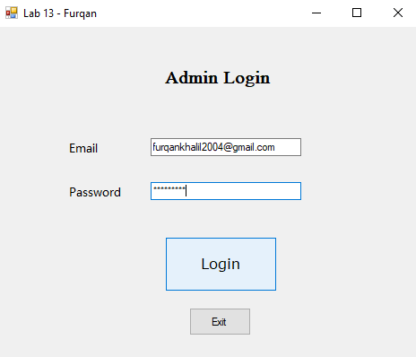
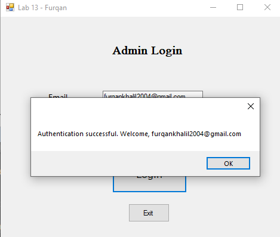
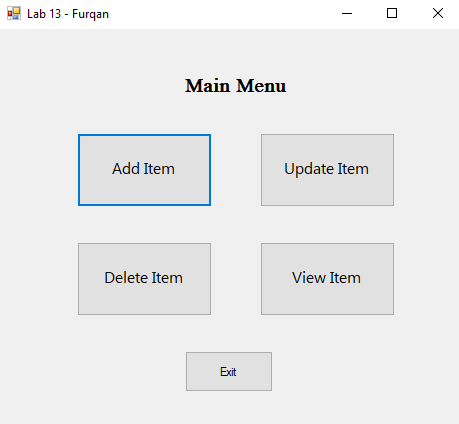
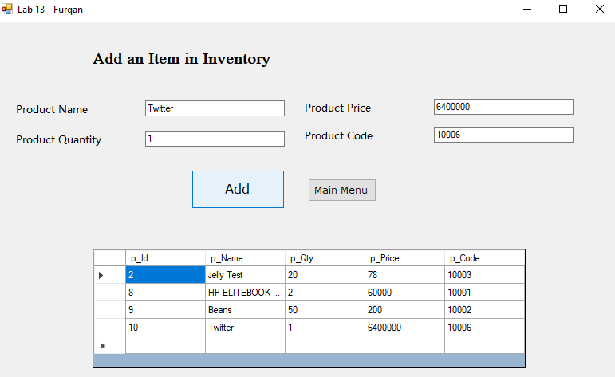
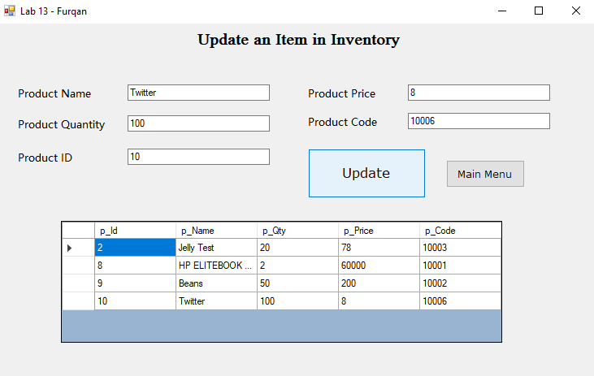
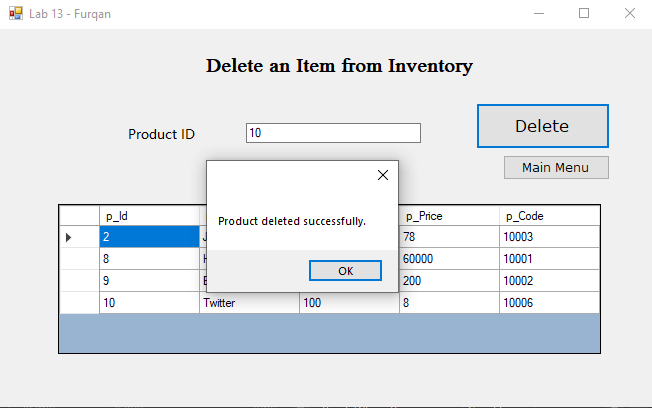
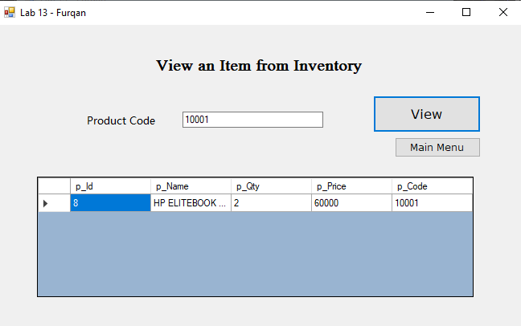

# OOP Lab Tasks (C# .NET Frameqork 4.7.2)

## Lab Task 13 - Q1

Make C# application with database connectivity and perform 4 basic function of add, delete, update and select of database. 

### Output

[FurqanHun Github](https://github.com/FurqanHun)