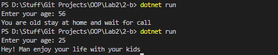

# OOP Lab Tasks (C# .NET 7.0)

## Lab Task 02 - Part b

Write a program which takes user’s input for age and on basis of that input gives the following output:

- If Age is greater than 45 then prints the message “You are old stay at home and wait for call”
- If Age is less than 30 then prints “Hey! Man enjoy your life with your kids”

Use Switch statement in b Task

### Output

[FurqanHun Github](https://github.com/FurqanHun)