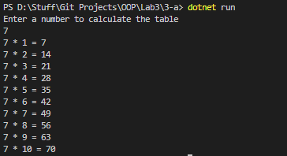

# OOP Lab Tasks (C# .NET 7.0)

## Lab Task 03 - Part a

Write a program to display table of a number, get input by user.

*Hint: Use for loop*

### Output

[FurqanHun Github](https://github.com/FurqanHun)