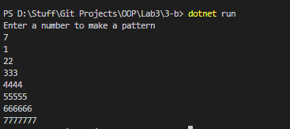

# OOP Lab Tasks (C# .NET 7.0)

## Lab Task 03 - Part b

Write a program to print following output using for loop.

```bash
1
22
333
4444
55555
```
*Hint: Use nested for loop.*

### Output



[FurqanHun Github](https://github.com/FurqanHun)