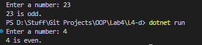

# OOP Lab Tasks (C# .NET 7.0)

## Lab Task 04 - Qd

Write a C# program that implements a function CheckEvOdd that checks that a umber input by user is even or odd.

### Output

[FurqanHun Github](https://github.com/FurqanHun)