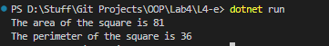

# OOP Lab Tasks (C# .NET 7.0)

## Lab Task 04 - Qe

Write a C# program that calculates area and perimeter of square in a function. Name CalculateArea and CalulatePeri respectively. Pass the values to the function from main () while calling functions.

### Output

[FurqanHun Github](https://github.com/FurqanHun)