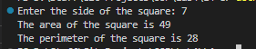

# OOP Lab Tasks (C# .NET 7.0)

## Lab Task 04 - Qf

Write a C# program that calculates area and perimeter of square in a function. Name CalculateArea and CalulatePeri respectively. The values that will be passed to the functions will be first input by user.

### Output

[FurqanHun Github](https://github.com/FurqanHun)