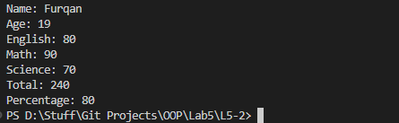

# OOP Lab Tasks (C# .NET 7.0)

## Lab Task 05 - Q2

Create a class student with a data members name, age, marks of English , marks of math, marks of science, total marks, obtained marks and percentage provide member functions CalculateTotalMarks and CalculatePercentage to calculate marks and percentage in main.

### Output

[FurqanHun Github](https://github.com/FurqanHun)