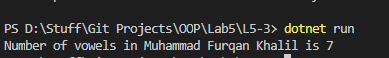

# OOP Lab Tasks (C# .NET 7.0)

## Lab Task 05 - Q3

Write a program that contains a class which has a method that takes user name as input and second functions which returns number of vowels present in it and Main program prints the number of vowels

### Output

[FurqanHun Github](https://github.com/FurqanHun)