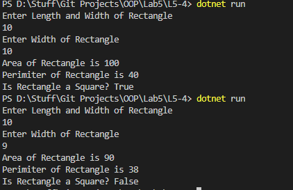

# OOP Lab Tasks (C# .NET 7.0)

## Lab Task 05 - Q4

Create a rectangle class with two data members’ length and width Provide member functions to calculate the perimeter and area of the rectangle and a function square which returns true if the rectangle is a square otherwise it returns false.

### Output

[FurqanHun Github](https://github.com/FurqanHun)