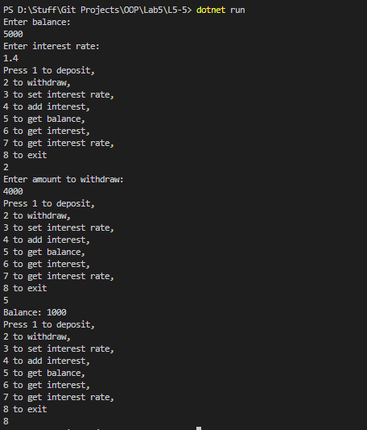

# OOP Lab Tasks (C# .NET 7.0)

## Lab Task 05 - Q5

Write a class to simulate a bank account allowing for initialization, deposits, withdrawals, setting the interest rate, adding interest and giving the current balance. Provide some code to demonstrate the object in action

### Output

[FurqanHun Github](https://github.com/FurqanHun)