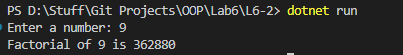

# OOP Lab Tasks (C# .NET 7.0)

## Lab Task 06 - Q2

Write a program to explain method in C#. Create a static function factorial() that accept a number from user and returns factorial of the number.

### Output

[FurqanHun Github](https://github.com/FurqanHun)