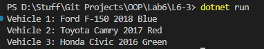

# OOP Lab Tasks (C# .NET 7.0)

## Lab Task 06 - Q3

Write a main method for your Vehicle class that creates a few vehicles and prints out their field values. Make the fields in your Vehicle class private, and add accessor and mutator methods for the fields.

### Output

[FurqanHun Github](https://github.com/FurqanHun)