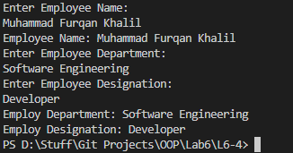

# OOP Lab Tasks (C# .NET 7.0)

## Lab Task 06 - Q4

Write a C# code which created a public class Employee with its public member variables name, dept and design. Now create method EmpName() which takes user input for emaployee name and then pint the name also. Create another method DeptList() that takes input the name of department of employee and third method as EmpDesig() which just takes input about employee’s designation. In main call these methods and print appropriate results.

### Output

[FurqanHun Github](https://github.com/FurqanHun)