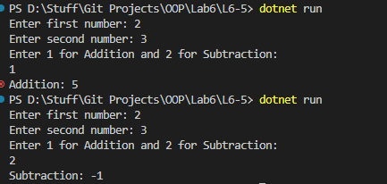

# OOP Lab Tasks (C# .NET 7.0)

## Lab Task 06 - Q5

Write code which creates a class Calculation and declare methods like Add() and Subtract(). Take two private variables a and b and take user input for these variables that would later be passed to the appropriate method for calculations.

### Output

[FurqanHun Github](https://github.com/FurqanHun)