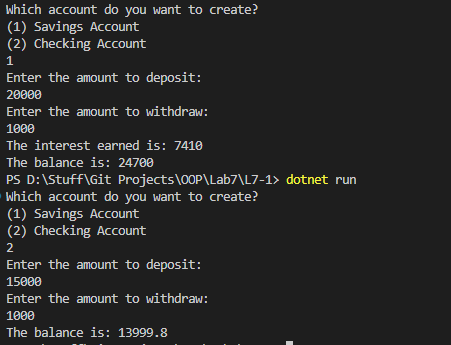

# OOP Lab Tasks (C# .NET 7.0)

## Lab Task 07 - Q1

Create an inheritance hierarchy that a bank might use to represent customers’ bank accounts. All customers at this bank can deposit (i.e., credit) money into their accounts and withdraw (i.e., debit) money from their accounts. More specific types of accounts also exist. Savings accounts, for instance, earn interest on the money they hold. Checking accounts, on the other hand, charge a fee per transaction (i.e., credit or debit). 

Create base class Account and derived classes Savings-Account and Checking Account that inherit from class Account. Base class **Account** should include
- Data member **account balance** (double)
- Member function **credit** should add an amount to the current balance.
- Member function **debit** should withdraw money from the Account and ensure that the debit amount does not exceed the Account’s balance. If it does, the balance should be left unchanged and the function should print the message "Debit amount exceeded account balance."
- Member function **getBalance** should return the current balance. 

Derived class **__SavingsAccount__** should inherit Account, include 
- A data member **interest rate** (percentage) assigned to the Account.
- Member function **calculateInterest** that returns a double indicating the amount of interest earned by an account.
*(Member function calculateInterest should determine this amount by multiplying the interest rate by the account balance)*

Derived class **CheckingAccount** should inherit Account and include
- An additional data member of type double that represents the fee charged per transaction.
- Member functions credit and debit so that they subtract the fee from the account balance whenever either transaction is performed successfully.
- CheckingAccount’s versions of these functions should invoke the base-class Account version to perform the updates to an account balance.
- CheckingAccount’s debit function should charge a fee only if money is actually withdrawn *(i.e., the debit amount does not exceed the account balance).*

### Output

[FurqanHun Github](https://github.com/FurqanHun)