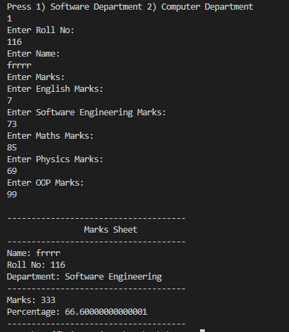
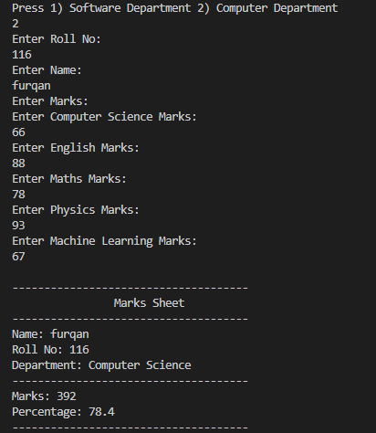

# OOP Lab Tasks (C# .NET 7.0)

## Lab Task 07 - Q2

Generate a marksheet of different departments with proper record and calculate percentage with average of different subjects using Multilevel inheritance.

### Output

[FurqanHun Github](https://github.com/FurqanHun)