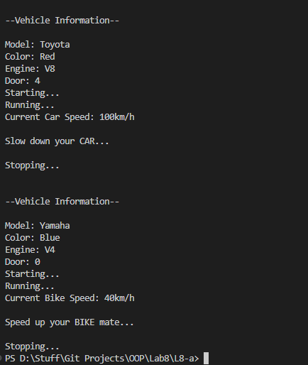

# OOP Lab Tasks (C# .NET 7.0)

## Lab Task 08 - Qa

Create a class Vehicle which contains following data members, constructors and functions.

**Data Members:**
- string model;
- string color;
- string engine;
- int door;

**Constructors:**
- Vehicle(),
- Vehicle(string, string, string, string,int),

**Function:**
- void start();
- void stop();
- void run();
- virtual void calculateSpeed()=0;
- void printInfo();

Inherit car and bike class from the vehicle class and override the virtual method calculateSpeed() in both classes

### Output

[FurqanHun Github](https://github.com/FurqanHun)