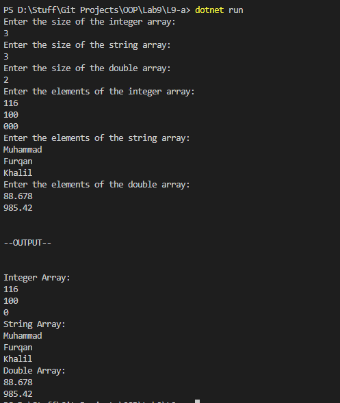

# OOP Lab Tasks (C# .NET 7.0)

## Lab Task 09 - Qa

Write C# code for implementing arrays that accepts user inputs and then displays them. Take different arrays like this: stringArray, integerArray, doubleArray.

### Output

[FurqanHun Github](https://github.com/FurqanHun)