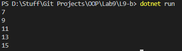

# OOP Lab Tasks (C# .NET 7.0)

## Lab Task 09 - Qb

Write a program that adds two arrays and then displays the result. Initialize static array.

### Output

[FurqanHun Github](https://github.com/FurqanHun)