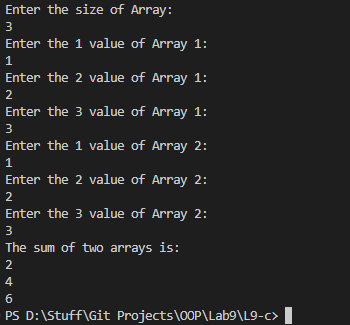

# OOP Lab Tasks (C# .NET 7.0)

## Lab Task 09 - Qc

Write a program that takes input from user for intMyArray1 and intMyArray2 and then adds up these two arrays and stores result in third array inyMyRsultantArr. The result must also be displayed.

### Output

[FurqanHun Github](https://github.com/FurqanHun)