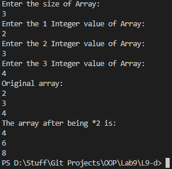

# OOP Lab Tasks (C# .NET 7.0)

## Lab Task 09 - Qd

Write a program that displays the elements of array initialized by user after being multiplied by 2.

### Output

[FurqanHun Github](https://github.com/FurqanHun)