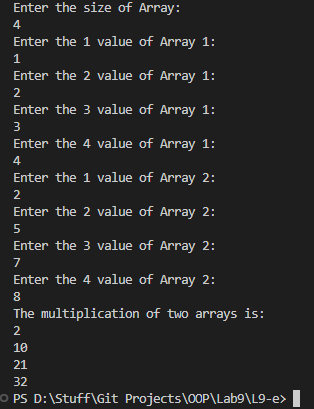

# OOP Lab Tasks (C# .NET 7.0)

## Lab Task 09 - Qe

Write a program that inputs two arrays from user and then multiply both arrays and displays result into another array.

### Output

[FurqanHun Github](https://github.com/FurqanHun)