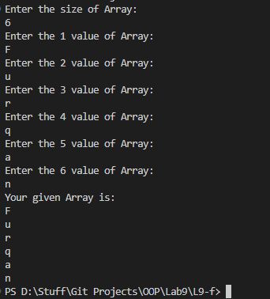

# OOP Lab Tasks (C# .NET 7.0)

## Lab Task 09 - Qf

Write a program that implements a PrintArray function which displays array being passed to it. Initialize a string array in Main and then pass it to the function.

### Output

[FurqanHun Github](https://github.com/FurqanHun)